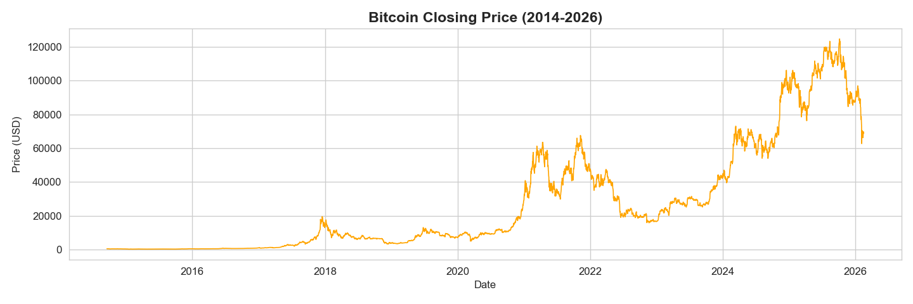
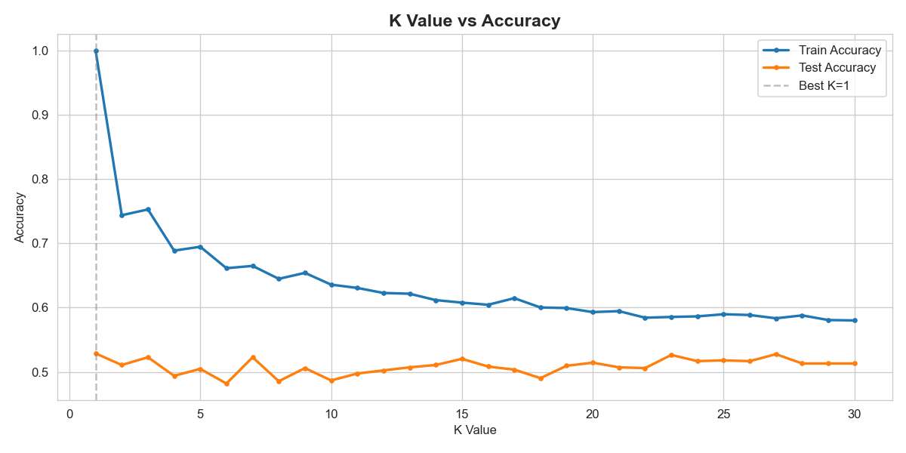
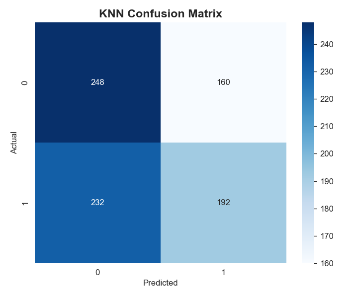
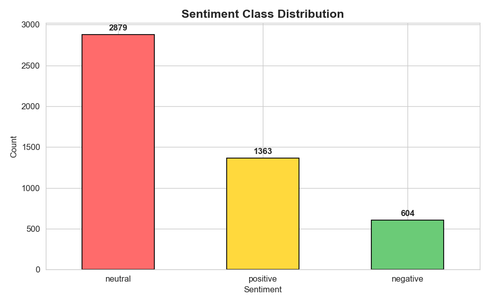
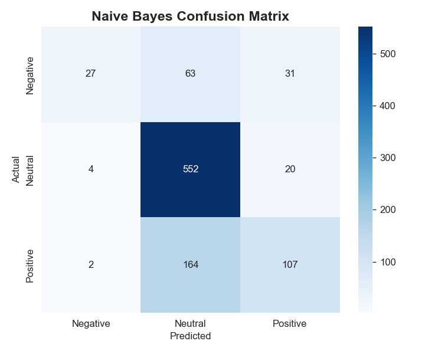
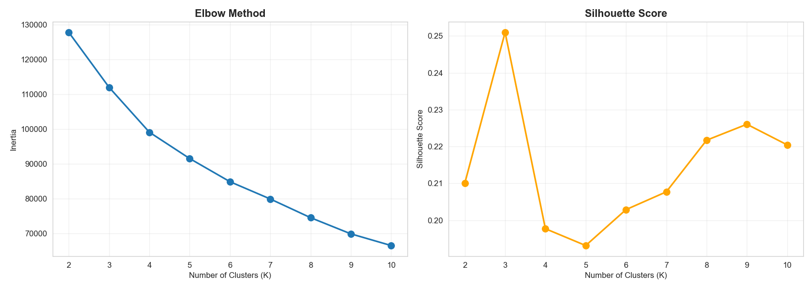
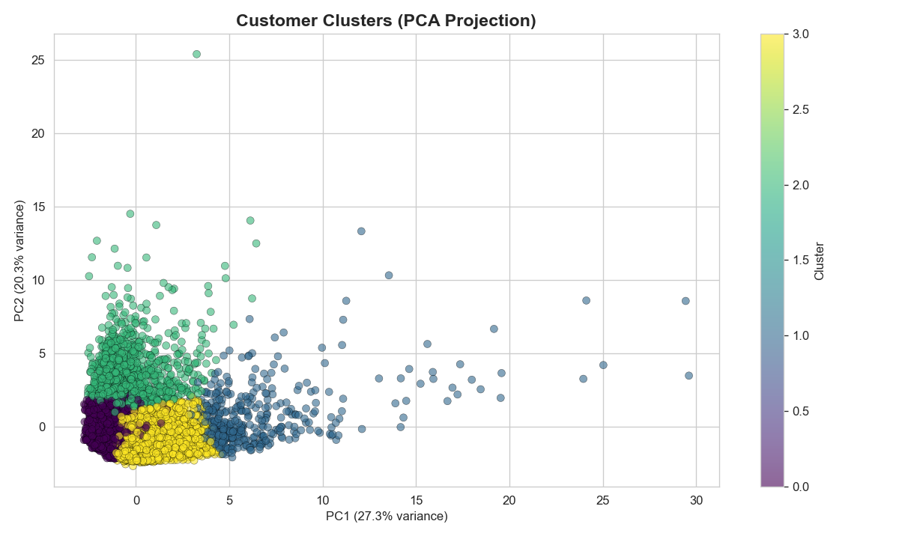
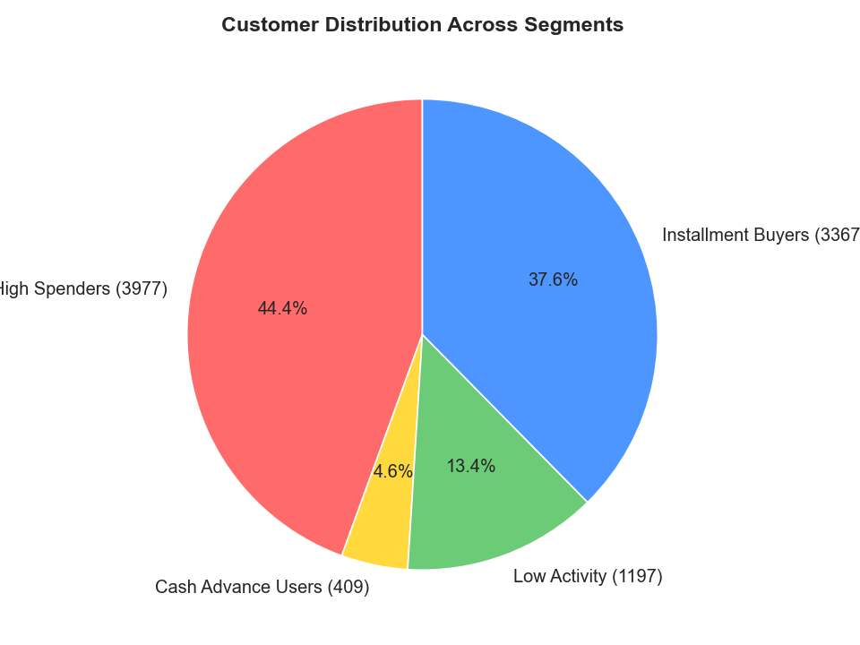

# Financial-ML-Algorithms

**Three Machine Learning Algorithms on Financial Datasets**

| Algorithm | Dataset | Task |
|-----------|---------|------|
| **KNN** | Crypto OHLCV (Top 50 Cryptocurrencies 2014–2026) | Predict next-day Bitcoin price direction |
| **Naive Bayes** | FinancialPhraseBank (4,845 headlines) | Classify financial news sentiment |
| **KMeans** | CC GENERAL (8,950 credit card users) | Segment customers by spending behavior |

---

## K-Nearest Neighbors — Crypto Price Direction

Predict whether Bitcoin closes **UP** or **DOWN** tomorrow by finding similar historical price patterns.

**Features:** Returns, HL Range, Moving Averages, RSI, Volatility, Volume Change

| BTC Price History | Optimal K Selection | Confusion Matrix |
|:---:|:---:|:---:|
|  |  |  |

---

## Naive Bayes — Financial News Sentiment

Classify news headlines as **Positive**, **Neutral**, or **Negative** using Multinomial Naive Bayes with TF-IDF features.

| Sentiment Distribution | Confusion Matrix |
|:---:|:---:|
|  |  |

---

## KMeans — Credit Card Customer Segmentation

Group 8,950 customers into behavioral segments using K-Means clustering.

| Elbow & Silhouette | PCA Clusters | Segment Distribution |
|:---:|:---:|:---:|
|  |  |  |

---

## Files

| File | Description |
|------|-------------|
| `KNN_Crypto_Price_Prediction.ipynb` | K-Nearest Neighbors notebook |
| `NaiveBayes_Financial_Sentiment.ipynb` | Multinomial Naive Bayes notebook |
| `KMeans_Customer_Segmentation.ipynb` | K-Means Clustering notebook |
| `AI_Project_Report.pdf` | Project report |
| `AI_Project_Slides.pptx` | Presentation slides |
| `all-data.csv` | Financial news dataset |
| `CC GENERAL.csv` | Credit card dataset |
| `crypto50_combined.csv` | Cryptocurrency OHLCV dataset |
| `images/` | Output visualizations |

## How to Run

1. Upload the CSV files and notebooks to Google Colab
2. Update the Drive mount path in the first cell to match your folder
3. Run all cells
